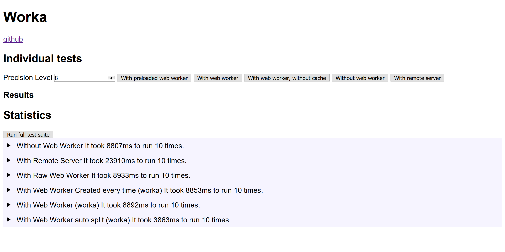

# worka


## Why

Working with Web Workers is interesting because it makes things previously only available to native software possible on the web also. But multi threading is hard to get right, and that's why I use patterns to stay correct. These patterns were previously duplicated across different web-applications. These patterns are now encapsulated into a library (worka) to avoid duplication. Use cases of web workers:

 * Offload work (computations) from server to client
 * Avoid blocking the main-DOM thread
 * Audio, video, canvas background processing
 * Progressive Enhancement


## What

worka.js is an abstraction layer on top of web worker, with a declarative life cycle. Encapsulation of useful patterns. Some features:

 * Promised based API
 * Worker auto split into more workers
 * Time out management
 * Worker Life-cycle management
 * Small file and zero dependencies


## How/Install

With a module to be imported. [source/worka.js](./source/worka.js). Also available via [NPM](https://www.npmjs.com/package/worka). `npm install worka`


## Inspiration

Inspired by the clean stateless HTTP architecture, something comes in, something comes out.


### Shortest Example


```html
<!doctype html>
<html lang="en">
    <head>
        <meta charset="utf-8">
        <meta name="viewport" content="width=device-width">
    </head>
    <body>
        <p>Open console</p>
        <script type="module">
import {
    registerWorker,
    work,
    FUNCTION,
} from "worka";

const sort = function (array) {
    array.sort();
    return array;
};

registerWorker({
    name: `sort`,
    resource: sort,
    loadMode: FUNCTION,
});

work({name: `sort`, input: [1, 2, 3, -8, -5, 2, 3, 45, 5]}).then(function (result) {
    // result is a copy
    console.log(result);
});

    </script>
    </body>
</html>
```


## Limitations


The state, variables and closures are not shared between DOM globals and Web Worker globals. All required inputs must be sent directly. Web Worker cannot directly touch the [DOM/HTML and some other things also](https://nolanlawson.github.io/html5workertest/).

There is a hard limit (about 1300 kB per message) on the amount of data send and received from and to a worker. Worker from tabs that do not have focus, may be throttled down. There is a limit on the amount of workers allowed , and crossing that limit may silently kill worker. The hope and lazy parameters of worka do help.

## Import

```js
// module
import {
    registerWorker,
    work,
    workerSupport,
    decorateWorker,

    STRING,
    DECORATED,
    FUNCTION,
    MULTI_FUNCTION,
    FILE,
    DECORATED_FILE,
    NO_SUPPORT_ERROR,
    TIME_OUT_ERROR,
} from "worka";

// node11-
const {registerWorker, work, ...} = require("worka/built/worka_require.js");
```

## API

 * [registerWorker](#registerWorker)
 * [work](#work)
 * [workerSupport](#workersupport)


### registerWorker

`registerWorker(options);`


returns undefined. Immediately registers a worker. Registration is required before usage.


#### options (required)


Describes the worker. Example:


```
{
    name: `workerName`,
    resource: myFunction,
    loadMode: FUNCTION,
    lazy: 5,
    hope: 6,
    max: navigator.hardwareConcurrency || 1,
    stateless: true,
    initialize: false,
    timeOut: false
}
```


#### name (required)


`Symbol` or `String` that uniquely identifies a worker.


#### resource (required)

`String` or `Function` or `Any`

Any value that can help build the worker. Must be in sync with `loadMode`. For example if loadMode is set to load a function, provide a function as resource. Resource gives the core functionality of the worker.


#### loadMode (required)


Possible Values: `FUNCTION, STRING, MULTI_FUNCTION FILE`


Partial Default


```
{
    loadMode: STRING
}
```


To use multiple functions inside 1 Worker use `MULTI_FUNCTION` and provide as a `resource` a function that returns an object with multiple functions. Individuals keys of the object are later used to activate the targeted function.


```js
const returnsMultipleFunctions = function () {

    const sort = function (array) {
        array.sort();
        return array;
    };

    const addNegativeLength = function (array) {
        array.push(-array.length);
        return array;
    };

    return {
        sort,
        addNegativeLength
    };
};

registerWorker({
    name: `test`,
    resource: returnsMultipleFunctions,
    loadMode: MULTI_FUNCTION
});

work({
    name: `test`,
    functionName: `sort`,
    input: [1,2,3,-8,-5,2,3,45,5],
}).then(function (result) {
    console.log(result);
});

work({
    name: `test`,
    functionName: `addNegativeLength`,
    input: [1,2,3,-845,5],
}).then(function (result) {
    console.log(result);
});
```

The rest of the options are optional. Jump to [work](#work).


#### Stateless


Partial Default


```
{
    stateless: true
}
```


Pure functions are stateless. Function that change variables other than the return value are statefull (Worker that do not use transferable, have a copy of the input, not the input itself, which means a top level function inside a worker can change the __copied__ input and still be pure). Statefull component will never auto split into multiple workers. Before using statefull workers everywhere, consider moving the state up; moving the state in the main thread, mutate it only there, and providing it to the worker each time alongside the regular input. There is no need to set `initialize`. To provide a statefull function use `stateless: false` and the following format:


```js
// Also known as the generator pattern
const statefullGenerator = function () {
    // state declaration and initialization
    // it is encapsulated and not accessible from the outside
    let x = 0;
    return function (input) {
        // function to execute each time, with input
        // can change outer state
        // this function is not pure
        x += input;
        return x;
    };
};

registerWorker({
    name: `stateTest`,
    resource: statefullGenerator,
    loadMode: FUNCTION,
    stateless: false
});

work({name: `stateTest`, input: 5}).then(function (result) {
    console.log(result); // 5
    return work(name: `stateTest`, input: 5});
}).then(function (result) {
    console.log(result); // 10
});
```


#### initialize


To force an initialization phase, use `initialize: true` and use the delayed initialization pattern: Provide a function that returns a function that will run on each `work` and that closes over variables defined once. This is especially useful to create large constant values once only or use recursive functionality.


Partial Default


```
{
    initialize: false
}
```

```js
const functionReturner = function () {

    const largeConstantInitialization = [
        `could be a long array`,
        `or something that would be`,
        `costly to create each time`
    ];

    let recursiveFunction;

    recursiveFunction = function ({input = ``, tree}) {
        const localTextContent = tree.textContent;
        const allTextContent = `${input} > ${localTextContent}`;
        if (tree.child) {
            return recursiveFunction({input: allTextContent, tree: tree.child});
        }
        return allTextContent;
    }
    return recursiveFunction;
};

registerWorker({
    name: `initializationTest`,
    resource: functionReturner,
    loadMode: FUNCTION,
    initialize: true
});

const recursiveDataStruct = {
    textContent: `top level`,
    child: {
        textContent: `middle level`,
        child: {
            textContent: `bottom level`,
            child: {
                textContent: `underground`,
                child: {
                    textContent: `-10`
                }
            }
        }
    }
};
work({name: `initializationTest`, input: {tree: recursiveDataStruct}})
.then(function (result) {
    console.log(result);
    // > top level > middle level > bottom level > underground > -10
});
```


#### Hope


Hope is a number that helps make assumptions about the lifecycle of the worker. A worker with 0 hope is going to be deleted after it is used. A worker with lots of hope is going to be kept after each usage.


Partial Default


```
{
    hope: 6
}
```


 * 6+ no effect default value
 * 5 immediately terminated after each use
 * 1 - 4 place-holders do not use
 * 0 immediately unregistered and deleted after use and all the above. Use this for a 1 time computations only.

5 Use this to free up memory at the expense of slower restart. Do not use if you know the work will be done again.

0 Use this for a 1-time computation only.


#### Lazy


Lazy is a number that helps make assumption about the life cycle of the worker. A worker with 0 lazy is going to be absolutely ready before it is going to be used. A worker with 5 lazy is going to initialize only when needed. The lazy value has an effect on registerWorker only.


Partial Default


```
{
    lazy: 5
}
```

 * 5+ no effect, slowest first start, lowest memory usage
 * 4 worker is preloaded
 * 3 worker is decorated and all the above
 * 2 worker is instanciated and all the above
 * 1 place holder do not use
 * 0 worker is started, and initialization is run and all the above


#### Time out


`false` or a positive integer `Number`


By default there is no time out. The time out timing start just after work(...).then(...). If the operation takes longer the Promise will reject with TIME_OUT_ERROR.


Partial Default


```
{
    timeOut: false
}
```


#### max

Integer `Number` equal or above `1`.


By default each registered worker will spawn copies of itself when ever `work()` is called while there is already a worker computing. `max` describes the maximum amount of Web Worker for this registered worker. Do not include this option unless you know exactly why and what you are doing. Statefull worker will not spawn copies of itself by default.


Partial Default


```
{
    max: navigator.hardwareConcurrency || 1
}
```


### work

`work({name, input, functionName});`


Returns a promise that eventually resolves with the result or fails. Use registerWorker first !


```js
work({name:`test/sort`, input: [1,2,3,-8,-5,2,3,45,5]}).then(function (result) {
    console.log(result);
}).catch(function (reason) {
    if (reason === NO_SUPPORT_ERROR) {
        console.error(`Web Worker API not supported`);
    } else if (reason === TIME_OUT_ERROR) {
        // can only happen with a worker registered with a timeOut
        console.error(`Took longer than expected`);
    } else {
        console.error(`other error`, reason);
    }
});
```

#### name (required)


the name of the worker or `${name}/${functionName}`.


#### input


The input that will be provided to the worker. To pass multiple inputs use a container, such as an Array or an Object.


### workerSupport

*Read-only*  Object describing the support matrix for web workers.

```
{   
    basic: Boolean
    transferrables: undefined // for now
}
```


## Advanced topics


### Fall back strategy

When web workers are not supported the promise from `work` will reject. It is possible to do something else in the catch. Below an example where `fetch` is used as a fall-back. Other web worker libraries presented below will automatically switch to `<iframe>` or `setInterval`. While great for developer experience, it may come with security back-doors and/or inconsistencies.


### Worker First, network second

```js
const fetchFromNetwork = function (precision) {
    return fetch(`../estimatePi?input=${precision}`, {}).then(function (response) {
        return response.text();
    }).then(function (resultString) {
        const result = Number(resultString);
        return result;
    });
};

const promise = work({name: `getPiEstimation`,input: precision}).catch(function (error) {
    if (error === NO_SUPPORT_ERROR) {
        return fetchFromNetwork(precision);
    } else {
        throw error;
    }
});

```


### Network first, worker second


```js
const promise = fetch(`../estimatePi?input=${precision}`, {}).then(function (response) {
    return response.text();
}).then(function (resultString) {
    const result = Number(resultString);
    return result;
}).catch(function (noNetwork) {
    return work({name: `getPiEstimation`, input: precision});
});
```

### Race

Before using `Promise.race`, read about its limitations.

```js
const fetchFromNetwork = function (precision) {
    return fetch(`../estimatePi?input=${precision}`, {}).then(function (response) {
        return response.text();
    }).then(function (resultString) {
        const result = Number(resultString);
        return result;
    });
};

const promise = Promise.race([
    work({name: `getPiEstimation`, input: precision}),
    fetchFromNetwork(precision)
]);

```


### Extensions


#### Memoize

Memoize is not included by default for maximum flexibility. It is possible to memoize the resolution value from the worker with an external library like [promise-memoize](https://github.com/nodeca/promise-memoize). Learn about the limitations of memoization first.


```npm install promise-memoize```


```js
import promiseMemoize from "promise-memoize";


// register worker
registerWorker({
    name: `getPiEstimation`,
    resource: estimatePi,
    loadMode: FUNCTION
});

// create memoized version
const memoized = promiseMemoize(function(precision) {
    return work({name: `getPiEstimationForceRestart`, input: precision});
});

// use it

memoized(1000).then(...);
memoized(1000).then(...);

// note it is also possible to memoize everything like this
const memoizedWork = promiseMemoize(work);
```


## Alternatives

 * https://github.com/andywer/threads.js
     * Also works for NodeJS
     * Also for non ES6
     * Transferrables
     * More complex
 * https://github.com/padolsey/operative
     * Falls back to using iframes
     * high range of browser support
     * Promise or callback based
 * https://github.com/nolanlawson/promise-worker
     * Smaller
     * Also promised based
 * raw web worker
     * More freedom but might have to reinvent patterns discovered here


## About this package

### Contributions

Contributions welcome :)

### To Do

 * report progress system design (streams ?)
 * es5 and old browser support
 * Opt in for transferable, maybe with [Atomic operations](https://github.com/tc39/ecmascript_sharedmem/blob/master/TUTORIAL.md)
 * Allow asynchronous functions

### Optimisation ideas

remove unused things inside worker, like originalAsString if it is never going to be used again

could change workerWithLowestResolveQueue, instead of guessing what worker will be idle the soonest,
we could wait for the next worker to become idle, could be better than guessing,
especially for function that have variability in time needed for execution

proper de-registration for failures ?

alternative feature detection
https://github.com/pmav/web-workers/blob/master/assets-web-workers/javascript-webworkers-ui.js */


### Some tests

Look at the /example folder

Steps with npm cli:

 * cd example
 * npm install
 * cd ..
 * node example/index.js 8080
 * open http://localhost:8080/example/example.html

There you can compare

 * With preloaded web worker
 * With web worker
 * With web worker, without cache
 * Without web worker
 * With remote server

The results can vary a lot and depends, on network condition, ability to run the software in
parallel (often in %), setup time/work time,

Feel free to open issue to know more.



### The name

*worka* was chosen to keep it short and *worker* was already taken.


### Updates

#### 8.0.0

Symbols are exported individually

work expects an object as argument

for MULTI_FUNCTION, functionName is separated from name

#### 7.0.0

Move to ES Module first

#### 6.1.0

build-time decorateWorker exposed, FILE loadMode support

#### 6.0.0

built/worka_script.js and built/worka_require.js removed from git.
Use npm or run build yourself.

#### 5.0.0

Symbol is expected to be defined. Cleanup behaviour after error occurs, instead of never settled promised.

#### 4.0.3

Now importable with require. See built/worka_require.js

#### 4.0.0

Run time errors inside the worker will cause the catch statement to be executed with the error message inside as String. See example/workaRunTimeError.html Syntax Errors are not managed (same as before)

#### 3.1.3

Now importable as script. See built/worka_script.js

#### 3.0.0

Renamed SYMBOLS into WORKA_SYMBOLS

#### 2.1.1

Do less when there is no web worker support

#### 2.0.6

add `.npmignore` for light npm install


### License


[Boost License](./LICENSE.txt)
